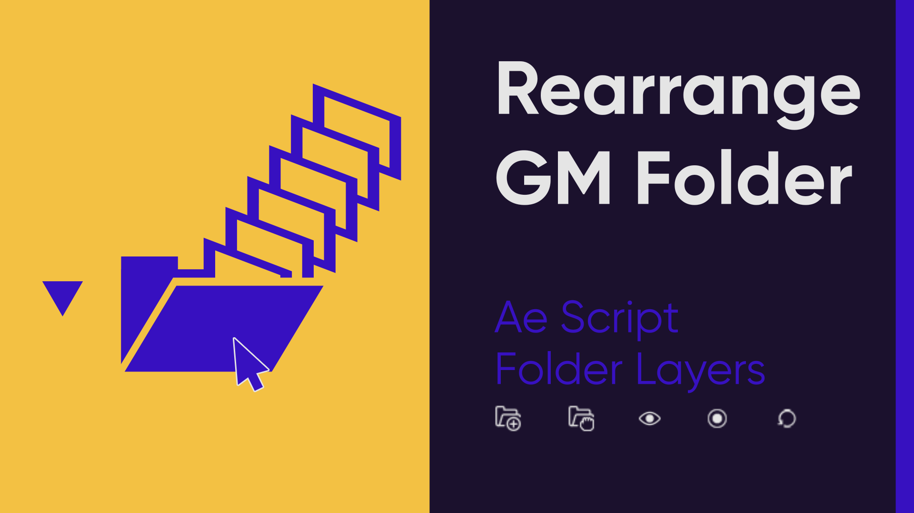
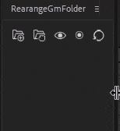
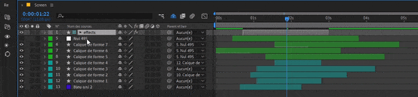

	

Help for Ae Script "Rearrange AeFolder" on Gumroad

 Feedback, bugs... send an email to : feedbackscript@outlook.fr

## What and why

Script for After Effects compatible with Kbar, work only with GM_FoldLayers (Free Tool)  .
https://web.archive.org/web/20160602080225/http://goodmotion.se/GM_FoldLayers_1.0.1.zip 

GM FoldLayers allow you make group layer and just a double clik to open it.

You can use it for free before to decide to go further with Rearrange AeFolder.

## So why using "Rearrange AeFolder" ?

The script Using the system of GM FoldLayers to really make folder on selects layers, move them, make it shy/visible and arrange all layers in timeline relate to the folder layer.

## Installation

First Install "GM FoldLayers" (follow the instruction in the .zip)
Second Install "Rearrange AeFolder" .jsxbin here:

Windows: Program Files\Adobe\Adobe After Effects \Support Files\Scripts\ScriptUI Panels

Mac: Applications/Adobe After Effects /Scripts/ScriptUI Panels

Adobe Ae have to connect internet to verify the license key. 
If you have a firewall (May be your office could Block the connection, can you check with your IT) allow the connection between after effect and internet. 

## Using

- Responsive Ui Vertical or Horizontal
	

	

- Create Folder

  Select your layers, name your folder, prompt pop-up keep the last name.
	
 Kbar Code: 'CreateFolder'
	

	

	
- Delete Folder
	
 Kbar Code: 'DeleteFolder'
- Move Folder
	
 Kbar Code: 'MoveFolder'
- Visible Folder
	
 Kbar Code: 'Visible'
- Shy Folder
	
 Kbar Code: 'Solo'
- Refresh Folder
	
 Kbar Code: 'Refresh'	

